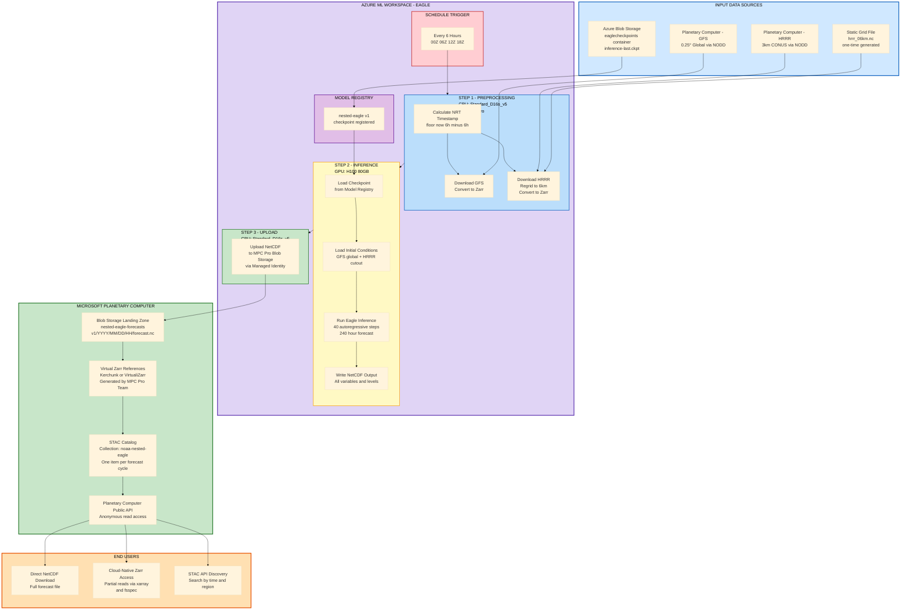

# Nested-EAGLE NRT: Architecture

## Overview

Nested-EAGLE is an AI weather forecasting model built on the ECMWF Anemoi framework. It runs in near-real-time (NRT) every 6 hours, producing 240-hour (10-day) forecasts by nesting a high-resolution HRRR grid (6km, CONUS) inside a global GFS grid.

---

## System Architecture



---

## Component Details

### Input Data Sources (Blue)

| Source | What | Where |
|---|---|---|
| **Planetary Computer - GFS** | Global Forecast System, 0.25° resolution, global | Available via NODD, in-Azure (no egress cost) |
| **Planetary Computer - HRRR** | High-Resolution Rapid Refresh, 3km CONUS | Available via NODD, in-Azure (no egress cost) |
| **Azure Blob Storage** | Model checkpoint (`inference-last.ckpt`, >1GB) | `eaglecheckpoints` storage account, `eagle-checkpoints` container |
| **Static Grid File** | `hrrr_06km.nc` — HRRR regrid target (one-time generated) | Stored alongside checkpoint or in AML datastore |

### Azure ML Workspace — Eagle (Purple)

**2 Compute Clusters, both scale-to-zero:**

| Cluster | SKU | vCPUs | RAM | GPU | Used By | Cost/hr |
|---|---|---|---|---|---|---|
| `eagle-cpu` | Standard_D16s_v5 | 16 | 64 GB | — | Step 1 (preproc) + Step 3 (upload) | ~$0.77 |
| `eagle-gpu` | NC40ads_H100_v5 | 40 | 320 GB | H100 80GB NVL | Step 2 (inference) | ~$6.98 |

**Pipeline: `nested-eagle-nrt` (3 steps)**

| Step | Name | Compute | Duration | What it does |
|---|---|---|---|---|
| 1 | Preprocessing | CPU | ~15-40 min | Calculate NRT timestamp, download GFS + HRRR from PC, regrid HRRR to 6km, write Zarr |
| 2 | Inference | GPU | ~5-20 min | Load checkpoint + ICs, run 40 autoregressive steps, write NetCDF |
| 3 | Upload | CPU | ~5-10 min | Upload NetCDF to MPC Pro blob storage via managed identity |

**Schedule:** RecurrenceTrigger every 6 hours (00Z, 06Z, 12Z, 18Z UTC)

**Model Registry:** Checkpoint registered as `nested-eagle:v1` for versioning and lineage tracking.

### Microsoft Planetary Computer (Green)

| Component | What | Who manages |
|---|---|---|
| **Blob Storage Landing Zone** | NetCDF files land here after each pipeline run | Provisioned by MPC Pro team; we write to it |
| **Virtual Zarr References** | Kerchunk/VirtualiZarr — maps Zarr chunk requests to byte ranges in the NetCDF | Generated by MPC Pro team (no data duplication) |
| **STAC Catalog** | `noaa-nested-eagle` collection, one item per forecast cycle | Created by MPC Pro team |
| **Public API** | Anonymous read access via Planetary Computer API | Managed by MPC Pro team |

### End Users (Orange)

| Access Method | How | Use Case |
|---|---|---|
| **Direct NetCDF Download** | Download full forecast file from blob or PC API | Traditional workflow, offline analysis |
| **Cloud-Native Zarr Access** | `xarray.open_zarr()` via virtual references | Partial reads — grab one variable, one timestep, no full download |
| **STAC API Discovery** | Query by time range, region, variable | Find specific forecasts programmatically |

---

## Boundary of Responsibility

```
┌──────────────────────────────────────┐  ┌──────────────────────────────────┐
│         OUR WORK (Microsoft)         │  │      MPC PRO TEAM'S WORK         │
│                                      │  │                                  │
│  • AML compute provisioning          │  │  • Blob storage provisioning     │
│  • Environment (Docker + conda)      │  │  • Virtual Zarr reference gen    │
│  • Pipeline build (3 steps)          │  │  • STAC catalog management       │
│  • Checkpoint registration           │  │  • Public API hosting            │
│  • Schedule trigger                  │  │  • Data freshness monitoring     │
│  • Managed identity + RBAC           │  │                                  │
│  • Monitoring + alerting             │  │                                  │
│  • Upload NetCDF + STAC Item to blob │  │                                  │
│                                      │  │                                  │
│  HANDOFF POINT: NetCDF + STAC ───────│──│──▶ MPC Pro picks it up           │
└──────────────────────────────────────┘  └──────────────────────────────────┘
```

---

## Data Flow (Single 6h Cycle)

```
Time: 14:30 UTC
│
├─ NRT timestamp = floor(14:30, 6h) - 6h = 06:00 UTC
│
├─ Step 1 (CPU, ~20 min):
│   ├─ Download GFS 06Z from Planetary Computer → gfs.zarr
│   └─ Download HRRR 06Z from Planetary Computer → regrid 6km → hrrr.zarr
│
├─ Step 2 (GPU, ~15 min):
│   ├─ Load: nested-eagle:v1 checkpoint (from Model Registry)
│   ├─ Load: gfs.zarr (global) + hrrr.zarr (CONUS cutout, trimmed edges)
│   ├─ Inference: 40 autoregressive steps × 6h = 240h forecast
│   ├─ Write: nested_eagle/inference/2026/03/16/06/forecast.nc
│   └─ Generate: nested_eagle/inference/2026/03/16/06/stac_item.json
│
├─ Step 3 (CPU, ~5 min):
│   └─ Upload forecast.nc + stac_item.json → blob://nested-eagle-forecasts/v1/2026/03/16/06/
│
└─ MPC Pro (their side):
    ├─ Detect new blob + STAC Item
    ├─ Generate virtual Zarr references
    ├─ Update STAC catalog (item: nested-eagle-20260316-06z)
    └─ Available on Planetary Computer public API
```

---

## Cost Profile (Per Run)

| Step | Compute | Duration | Cost |
|---|---|---|---|
| Preprocessing | CPU (D16s_v5) | ~20 min | ~$0.26 |
| Inference | GPU (H100) | ~10 min | ~$1.16 |
| Upload | CPU (D16s_v5) | ~5 min | ~$0.06 |
| **Total per run** | | **~35 min** | **~$1.48** |
| **Per day (4 runs)** | | ~2.3 hrs | ~$5.92 |
| **Per month** | | ~70 hrs | ~$178 |

*H100 is faster than A100 — inference may complete in ~10 min vs ~15 min. Cost-optimization: test down to A10 24GB (~$0.55/run, ~$66/month) if peak VRAM < 20GB.*
